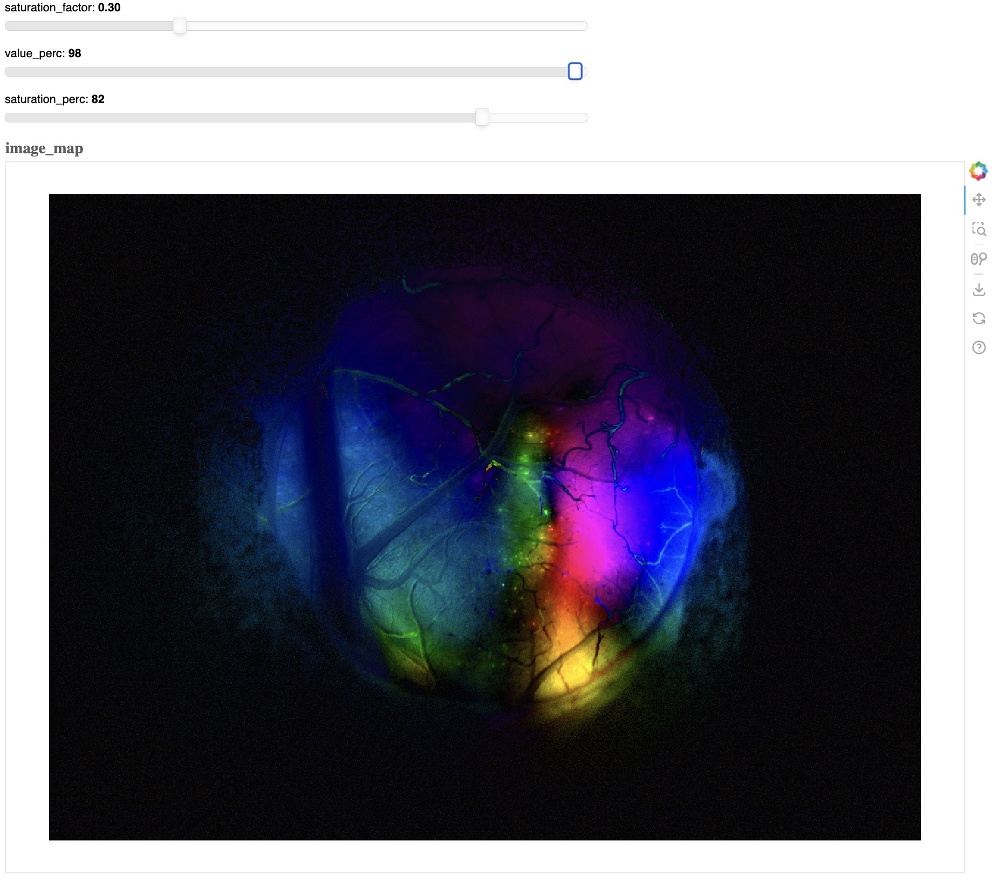
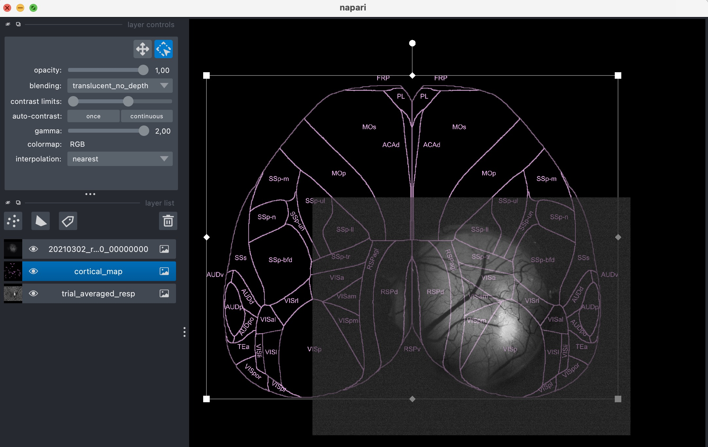

WideField
=========

This module provides tools for processing widefield video sequence data.

.. contents::
   :local:
   :depth: 2

Sequence Preprocessing
-------------------------

A preprocessing pipeline for widefield calcium imaging data. Computes ΔF/F with time-varying baseline using rolling window percentile calculation.

**Features:**

- Motion correction using ECC (Enhanced Correlation Coefficient) algorithm
- Rolling window baseline (F0) calculation with configurable percentile
- ΔF/F computation with interpolated baseline
- GPU acceleration support (CuPy) and Numba JIT optimization
- Memory-efficient chunked processing for large datasets

**CLI Usage:**

.. code-block:: bash

    $ nl_wfield preproc --file <TIF_FILE> [OPTIONS]
    $ nl_wfield preproc --directory <TIF_DIR> [OPTIONS]

**Options:**

.. code-block:: text

    Data I/O Options:
      --file FILE           Single input TIF file
      --directory DIR       Directory containing TIF files
      --suffix SUFFIX       File suffix pattern (default: .tif)
      --output_dir DIR      Output directory for results

    Processing Options:
      --motion_corr         Enable motion correction
      --max_shift N         Max shift in pixels for motion correction (default: 20)
      --rotate DEGREES      Rotate all sequences by specified degrees
      --chunk_size N        Frames per processing chunk (default: 3000)
      --window_size N       Rolling baseline window size in frames (default: 100)
      --percentile N        Percentile for baseline calculation (default: 10)
      --n_jobs N            Parallel jobs (-1 = all CPUs, default: -1)
      --force_compute       Force recomputation even if outputs exist
      --save_f0             Save F0 baseline to disk

    Acceleration Options:
      --use_gpu             Use GPU acceleration with CuPy

**Example:**

.. code-block:: bash

    # Basic preprocessing
    $ nl_wfield preproc --file recording.tif

    # With motion correction and GPU acceleration
    $ nl_wfield preproc --directory ./tifs --motion_corr --use_gpu

    # Custom parameters
    $ nl_wfield preproc --file data.tif --window_size 200 --percentile 5 --rotate 90

**Output Files:**

- ``dff.npy``: ΔF/F array (T, H, W)
- ``f0.h5``: F0 baseline array (if ``--save_f0`` enabled)
- ``reference_frame.tif``: Mean reference frame
- ``motion_transforms.h5``: Motion correction transforms (if ``--motion_corr`` enabled)
- ``metadata.json``: Processing parameters and data info

API reference:

- :doc:`../api/neuralib.widefield.preproc`
- :doc:`PreprocessOptions <../api/_autosummary/neuralib.widefield.preproc.PreprocessOptions>`
- :doc:`rotate_sequence <../api/_autosummary/neuralib.widefield.preproc.rotate_sequence>`
- :doc:`load_preprocess_meta <../api/_autosummary/neuralib.widefield.preproc.load_preprocess_meta>`

Widefield Transform
-------------------

The transform GUI registers widefield images to a dorsal cortex map. It supports
interactive point-pair selection, projective or similarity transforms, RANSAC
outlier handling, transform export, and live transformed-frame overlays.

**CLI Usage:**

.. code-block:: bash

    $ nl_wfield trans

API reference:

- :doc:`../api/neuralib.widefield.transform`
- :doc:`RegistrationOptions <../api/_autosummary/neuralib.widefield.transform.RegistrationOptions>`
- :doc:`RegistrationApp <../api/_autosummary/neuralib.widefield.transform.RegistrationApp>`

FFT View with Bokeh
---------------------

A Bokeh-based visualization of the HSV colormap representation of the Fourier-transformed video (e.g., for visual retinotopy).

Usage:

.. code-block:: python

    nl_wfield fft <FILE>

|fft_view|

Align with Napari
--------------------------

A Napari-based tool for aligning video data to a dorsal cortex view.

Usage:

.. code-block:: python

    nl_wfield align <FILE> [-R REFERENCE_FILE] [-M MAP_FILE]

|align_view|

